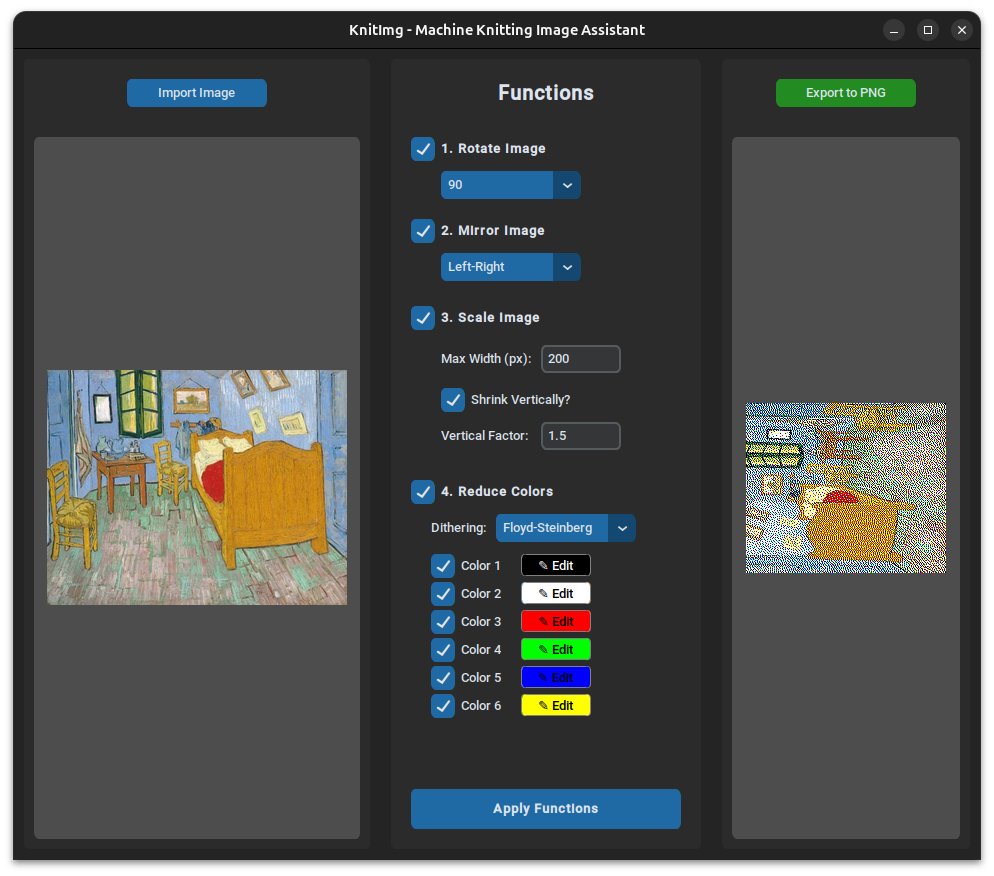

# KnitImg
A cross-platform helper program to modify images to be used with machine knitting. 

KnitImg allows you to import an image and sequentially apply:
- **Rotations** (90, 180, 270 degrees)
- **Scaling** (Resize by maximum width, and optionally shrink vertically to account for non-rectangular knitting stitch dimensions)
- **Reduce Colors** (Convert the image to a custom palette of up to 6 selectable colors, with or without dithering)

Once processed, you can export your optimized design for knitting directly to a PNG.

## Online option
There's an online version here: **[https://knitimg.streamlit.app/](https://knitimg.streamlit.app/)**

## Installation 

### Standalone (Recommended)
You can directly download the compiled standalone application from the **[Releases](../../releases)** page.

- **Windows**: [KnitImg-windows-x64.zip](../../releases/latest/download/KnitImg-windows-x64.zip)
- **Linux**: [KnitImg-linux-x64.tar.gz](../../releases/latest/download/KnitImg-linux-x64.tar.gz) / [KnitImg-linux-arm64.tar.gz](../../releases/latest/download/KnitImg-linux-arm64.tar.gz)

> **Note for macOS Users:** Standalone binaries for macOS are currently unavailable. Please run **From Source** (see below) or use the **Online Prototype**.

### Online Prototype (Streamlit)
You can also run a web-based version of KnitImg! This is perfect for quick tests or for users who cannot run the standalone application.

To run locally:
1. `pip install -r requirements.txt`
2. `streamlit run streamlit_app.py`

This will open the application in your default web browser.

---

Just download, extract, and run!

### From Source
Requires Python 3.12+ 

**macOS Tip:** You may need to install `python-tk` via Homebrew if you haven't already:
```bash
brew install python-tk
```

**Build and Run:**
```bash
git clone https://github.com/MRTNSLS/KnitImg.git
cd KnitImg
pip install -r requirements.txt
python main.py
```

## How to Use

1. Click **Import Image** to load your design.
2. Use the **Functions** panel to:
   - **Rotate/Mirror** (options 1 & 2).
   - **Scale** it for your machine's needle count (option 3).
   - **Reduce Colors** to a custom palette (option 4) with optional dithering.
3. Click **Apply Functions** to process, then **Export to PNG**.

<p align="center">
  
</p>

> **Tip:** Click the **✎ Edit** button on any color to choose a new custom color from the full-spectrum picker.

## Understanding Dithering

Choosing the right dithering algorithm can significantly impact how your image translates to yarn.

| Algorithm | Best For... | Description |
| :--- | :--- | :--- |
| **Atkinson** | Detailed Patterns | **Recommended.** High contrast and clean highlights. Avoids the "muddy" look and is excellent for machine knitting. |
| **Ordered (Bayer)** | Geometric Designs | Uses a fixed matrix to create predictable, structured textures. Great for a "pixel art" or retro feel. |
| **Floyd-Steinberg** | Smooth Gradients | The standard algorithm. Good for general photos but can sometimes create "noise" in light areas. |
| **Stucki / J-J-N** | High Detail | Large-kernel algorithms that produce very smooth transitions. Good for complex photographic images. |
| **Sierra / Lite** | Speed & Balance | A middle ground. Sierra Lite is very fast and works well for most simple designs. |
| **None** | Hard Edges | No dithering. Colors are mapped directly to the closest palette match. |


If you want to build the standalone executables yourself, use the provided `build.bat` (Windows) or `build.sh` (Linux/macOS) scripts.

```bash
pip install pyinstaller
./build.sh  # Or .\build.bat on Windows
```

## License

This software is licensed under the **GNU General Public License v3.0 (GPL-3.0)**. 
See the [LICENSE](LICENSE) file for the full text.

## Disclaimer of Liability

**THIS SOFTWARE IS PROVIDED "AS IS", WITHOUT WARRANTY OF ANY KIND, EXPRESS OR IMPLIED, INCLUDING BUT NOT LIMITED TO THE WARRANTIES OF MERCHANTABILITY, FITNESS FOR A PARTICULAR PURPOSE AND NONINFRINGEMENT. IN NO EVENT SHALL THE AUTHORS OR COPYRIGHT HOLDERS BE LIABLE FOR ANY CLAIM, DAMAGES OR OTHER LIABILITY, WHETHER IN AN ACTION OF CONTRACT, TORT OR OTHERWISE, ARISING FROM, OUT OF OR IN CONNECTION WITH THE SOFTWARE OR THE USE OR OTHER DEALINGS IN THE SOFTWARE.**

The authors are not responsible for any damage to knitting machines, wasted yarn, or incorrect patterns generated by the use of this software. Always verify your exported image dimensions and settings before transferring files to a physical knitting machine.
